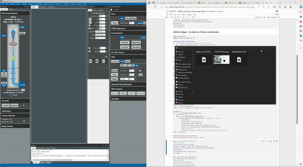

# pyAutoMic  
**AI-assisted intelligent microscopy**

---

## 1. DigitalMicrograph Remote Acquisition Tool  

📂 [Code Repository](https://github.com/pycroscopy/pyAutoMic/tree/main/TEM/DigitalMicrograph)  
📄 [Manuscript DOI](https://doi.org/10.1063/5.0225401)

---

## 2. STEM-Orchestrator: Real-Time Multimodal Data Acquisition in STEM  

📂 [Code Repository](https://github.com/pycroscopy/pyAutoMic/tree/main/TEM/stemOrchestrator)  
📄 [Manuscript DOI](https://doi.org/10.31224/4645)

---