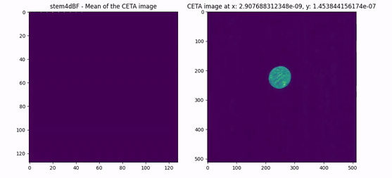

Workflows For AutoScript software by [ThermoFisher](https://www.thermofisher.com/us/en/home/electron-microscopy/products/software-em-3d-vis/autoscript-tem-software.html):

Example 1: 4dstem data acquisition (FPS 200)

More examples coming soon