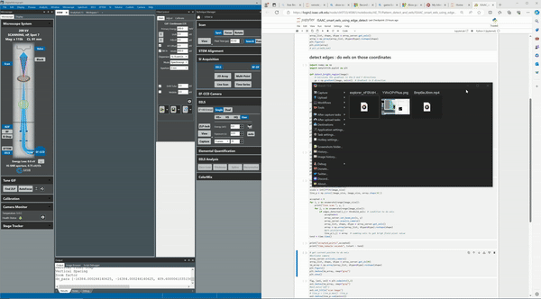

# DigitalMicrograph remote acquisition tool - [Accepted manuscript link](https://pubs.aip.org/aip/rsi/article-abstract/95/10/103701/3314792/Realizing-smart-scanning-transmission-electron?redirectedFrom=fulltext)

| Step Number | Action                           | Description                                                                                       |
|-------------|----------------------------------|---------------------------------------------------------------------------------------------------|
| 1           | Download files                   | Download the files from the GitHub.                                                               |
| 2           | Open Gatan Digital Micrograph    | Open the Gatan digital micrograph software.                                                       |
| 3           | Import server.py                 | Click on new script and import the server.py file.                                                |
| 4           | Edit server.py                   | Edit the server.py with the IP address of your computer and desired port (default is 9090).       |
| 5           | Execute the code                 | Execute the code by selecting Python and execute in background option.                           |
| 6           | Run the client                   | Run the client on any remote computer on the same network. Refer to the example Jupyter notebook |
|             |                                  | provided in the GitHub and correctly mention the port and IP of the server.                      |
------------------------------------------------------------------------------------------------------------------------------------------------------

## Todo:
Add more notebooks
