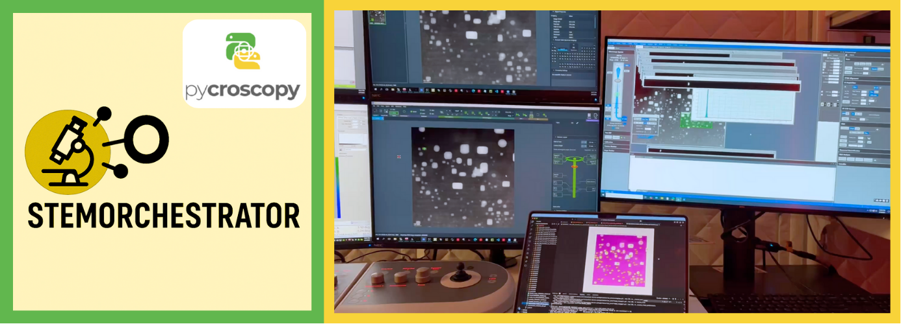

# STEM-Orchestrator : Enabling Real-Time Multimodal Data Acquisition in (Scanning transmission electron microscopes)STEM

Why do we need STEM-Orchestrator?
- The various hardware components[eels detector, in-situ-holders, aberration corrector etc] of a STEM system often operate in isolation and lack seamless communication.
-  STEM-Orchestrator bridges this gap, enabling synchronized control and data sharing across devices—crucial for deploying complex machine learning workflows at the atomic scale and accelerating materials characterization.

Interested in contributing?
 - Please check CONTRIBUTING.md 
 - reach out